### Java Collectors类**

// Stream API中最强大的接口之一

---

## 1 概述

```java
/**
 * Implementations of {@link Collector} that implement various useful reduction
 * operations, such as accumulating elements into collections, summarizing
 * elements according to various criteria, etc.
 *
 * <p>The following are examples of using the predefined collectors to perform
 * common mutable reduction tasks:
 *
 * <pre>{@code
 *     // Accumulate names into a List
 *     List<String> list = people.stream().map(Person::getName).collect(Collectors.toList());
 *
 *     // Accumulate names into a TreeSet
 *     Set<String> set = people.stream().map(Person::getName).collect(Collectors.toCollection(TreeSet::new));
 *
 *     // Convert elements to strings and concatenate them, separated by commas
 *     String joined = things.stream()
 *                           .map(Object::toString)
 *                           .collect(Collectors.joining(", "));
 *
 *     // Compute sum of salaries of employee
 *     int total = employees.stream()
 *                          .collect(Collectors.summingInt(Employee::getSalary)));
 *
 *     // Group employees by department
 *     Map<Department, List<Employee>> byDept
 *         = employees.stream()
 *                    .collect(Collectors.groupingBy(Employee::getDepartment));
 *
 *     // Compute sum of salaries by department
 *     Map<Department, Integer> totalByDept
 *         = employees.stream()
 *                    .collect(Collectors.groupingBy(Employee::getDepartment,
 *                                                   Collectors.summingInt(Employee::getSalary)));
 *
 *     // Partition students into passing and failing
 *     Map<Boolean, List<Student>> passingFailing =
 *         students.stream()
 *                 .collect(Collectors.partitioningBy(s -> s.getGrade() >= PASS_THRESHOLD));
 *
 * }</pre>
 *
 * @since 1.8
 */
```


## 2 收集器类的集合常量（read only）

 **Characteristics是Collector接口中的枚举类，内部包含了三个枚举常量用来描述收集器的状态**

```java
static final Set<Collector.Characteristics> CH_CONCURRENT_ID
            = Collections.unmodifiableSet(EnumSet.of(Collector.Characteristics.CONCURRENT,
                                                     Collector.Characteristics.UNORDERED,
                                                     Collector.Characteristics.IDENTITY_FINISH));
    static final Set<Collector.Characteristics> CH_CONCURRENT_NOID
            = Collections.unmodifiableSet(EnumSet.of(Collector.Characteristics.CONCURRENT,
                                                     Collector.Characteristics.UNORDERED));
    static final Set<Collector.Characteristics> CH_ID
            = Collections.unmodifiableSet(EnumSet.of(Collector.Characteristics.IDENTITY_FINISH));
    static final Set<Collector.Characteristics> CH_UNORDERED_ID
            = Collections.unmodifiableSet(EnumSet.of(Collector.Characteristics.UNORDERED,
                                                     Collector.Characteristics.IDENTITY_FINISH));
    static final Set<Collector.Characteristics> CH_NOID = Collections.emptySet();
```

## 3 构造方法

**仅有一个无参构造器**

```java
private Collectors() { }
```


## 4 Collectotlmpl（收集器的简单实现）

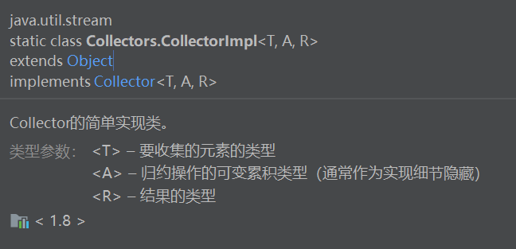

```java
	/**
     * Simple implementation class for {@code Collector}.
     *
     * @param <T> the type of elements to be collected
     * @param <R> the type of the result
     */
    static class CollectorImpl<T, A, R> implements Collector<T, A, R> {
        // 收集器必不可少的五个无参方法
        private final Supplier<A> supplier;
        // 用来提供收集过程中数据归约的容器(container)，eg.->(ArraysList::new)
        private final BiConsumer<A, T> accumulator;
        // 顾名思义，累加器方法；实现归约操作的核心方法；目的是将数据归约到容器A中
        private final BinaryOperator<A> combiner;
        // 合并容器
        private final Function<A, R> finisher;
        // 结果数据转换方法，将容器A转化为结果容器R
        private final Set<Characteristics> characteristics;
        // 定义已收集器的状态：1.concurrenty 2.unsorted 3.identify_finished

        // 构造器方法，初始化五个无参方法
        CollectorImpl(Supplier<A> supplier,
                      BiConsumer<A, T> accumulator,
                      BinaryOperator<A> combiner,
                      Function<A,R> finisher,
                      Set<Characteristics> characteristics) {
            this.supplier = supplier;
            this.accumulator = accumulator;
            this.combiner = combiner;
            this.finisher = finisher;
            this.characteristics = characteristics;
        }
		
        // 构造器方法二，使用默认转化方法
        CollectorImpl(Supplier<A> supplier,
                      BiConsumer<A, T> accumulator,
                      BinaryOperator<A> combiner,
                      Set<Characteristics> characteristics) {
            this(supplier, accumulator, combiner, castingIdentity(), characteristics);
        }
        
		// 实现Collector接口中的方法
        @Override
        public BiConsumer<A, T> accumulator() {
            return accumulator;
        }

        @Override
        public Supplier<A> supplier() {
            return supplier;
        }

        @Override
        public BinaryOperator<A> combiner() {
            return combiner;
        }

        @Override
        public Function<A, R> finisher() {
            return finisher;
        }

        @Override
        public Set<Characteristics> characteristics() {
            return characteristics;
        }
    }	
```

### 4.1 Collector中内置的finisher方法

```java
@SuppressWarnings("unchecked")
private static <I, R> Function<I, R> castingIdentity() {
    return i -> (R) i;
}
```

## 5 toCollection "by encounter order"

```java
	/**
     * Returns a {@code Collector} that accumulates the input elements into a
     * new {@code Collection}, in encounter order.  The {@code Collection} is
     * created by the provided factory.
     *
     * @param <T> the type of the input elements
     * @param <C> the type of the resulting {@code Collection}
     * @param collectionFactory a {@code Supplier} which returns a new, empty
     * {@code Collection} of the appropriate type
     * @return a {@code Collector} which collects all the input elements into a
     * {@code Collection}, in encounter order
     */	
	// Collection 集合的特点是：1 元素有序 2 集合不出现重复元素
    public static <T, C extends Collection<T>>
    Collector<T, ?, C> toCollection(Supplier<C> collectionFactory) {
        return new CollectorImpl<>(collectionFactory, Collection<T>::add,
                                   (r1, r2) -> { r1.addAll(r2); return r1; },
                                   CH_ID);
    }

CH_ID： 保证了A容器可以转化为R容器，否则会出现异常
```

## 6 toList 

```java
/**
 * Returns a {@code Collector} that accumulates the input elements into a
 * new {@code List}. There are no guarantees on the type, mutability,
 * serializability, or thread-safety of the {@code List} returned; if more
 * control over the returned {@code List} is required, use {@link #toCollection(Supplier)}.
 *
 * @param <T> the type of the input elements
 * @return a {@code Collector} which collects all the input elements into a
 * {@code List}, in encounter order
 */
public static <T>
Collector<T, ?, List<T>> toList() {
    return new CollectorImpl<>((Supplier<List<T>>) ArrayList::new, List::add,
                               (left, right) -> { left.addAll(right); return left; },
                               CH_ID);
}
```

## 7 toSet

```java
/**
 * Returns a {@code Collector} that accumulates the input elements into a
 * new {@code Set}. There are no guarantees on the type, mutability,
 * serializability, or thread-safety of the {@code Set} returned; if more
 * control over the returned {@code Set} is required, use
 * {@link #toCollection(Supplier)}.
 *
 * <p>This is an {@link Collector.Characteristics#UNORDERED unordered}
 * Collector.
 *
 * @param <T> the type of the input elements
 * @return a {@code Collector} which collects all the input elements into a
 * {@code Set}
 */
public static <T>
Collector<T, ?, Set<T>> toSet() {
    return new CollectorImpl<>((Supplier<Set<T>>) HashSet::new, Set::add,
                               (left, right) -> { left.addAll(right); return left; },
                               CH_UNORDERED_ID);
}
```

## 8 joining "字符归约收集器"

```java
/**
 * Returns a {@code Collector} that concatenates the input elements into a
 * {@code String}, in encounter order.
 // 根据输入的字符串顺序实现对数据的收集，没有A->R数据类型转化的要求
 *
 * @return a {@code Collector} that concatenates the input elements into a
 * {@code String}, in encounter order
 */
public static Collector<CharSequence, ?, String> joining() {
    return new CollectorImpl<CharSequence, StringBuilder, String>(
            StringBuilder::new, StringBuilder::append,
            (r1, r2) -> { r1.append(r2); return r1; },
            StringBuilder::toString, CH_NOID);
}
```

### 8.1 joining"带参"

```java
	/**
     * Returns a {@code Collector} that concatenates the input elements,
     * separated by the specified delimiter, in encounter order.
     *
     * @param delimiter the delimiter to be used between each element
     * @return A {@code Collector} which concatenates CharSequence elements,
     * separated by the specified delimiter, in encounter order
     */
    public static Collector<CharSequence, ?, String> joining(CharSequence delimiter) {
        return joining(delimiter, "", "");
    }
```

### 8.2 joining"最终实现"

```java
/**
 * Returns a {@code Collector} that concatenates the input elements,
 * separated by the specified delimiter, with the specified prefix and
 * suffix, in encounter order.
 *
 * @param delimiter the delimiter to be used between each element
 * @param  prefix the sequence of characters to be used at the beginning
 *                of the joined result
 * @param  suffix the sequence of characters to be used at the end
 *                of the joined result
 * @return A {@code Collector} which concatenates CharSequence elements,
 * separated by the specified delimiter, in encounter order
 */
public static Collector<CharSequence, ?, String> joining(CharSequence delimiter,
                                                         CharSequence prefix,
                                                         CharSequence suffix) {
    return new CollectorImpl<>(
            () -> new StringJoiner(delimiter, prefix, suffix),
            StringJoiner::add, StringJoiner::merge,
            StringJoiner::toString, CH_NOID);
}
```


## SUFFIX:(content in Java8InAction)

## 1 Use collect to get the maximum number of a stream

eg. Get the highest calories food in the dish

>a. define a comparator that can compare the calories of two dishes
>
>b. use the method collect call maxBy in the stream data structure 

```java
public int comparatorCalories(dish a,dish b){
    return a.getCalories - b.getCalories;
}
// 自定义比较器定义
Comparator<Dish> dishCaloriesComparator = Comparator.comparatorInt(Dish::getCalories)

dishes.stream().collect(maxBy(dish::comparatorCalories))
dishes.stream().collect(maxBy(Dish.dishCaloriesComparator))
dishes.stream().collect(max(dishCaloriesComparator))
```

## 2 Get Summarization Of a Stream

**Method is likely to the method of the reduce,with a initial value to add the each value **

>**import the static method** 

```java
import static java.util.stream.Collectors.summingDouble;
    
menu.stream().collect(summingDounle(Dish::getCalories));
menu.stream().mapToDouble(Dish::getCalories).sum();
```

## 3 Get the Averaging Data Of A Stream

```java
import static java.util.stream.Collectors.averaginDouble;
System.out.println(dishes.stream().collect(averagingDouble(Dish::getCalories)));
```

## 4 Get The Summerizing Data Of A Stream

```java
System.out.println(dishes.stream().collect(summarizingDouble(Dish::getCalories)));
// DoubleSummaryStatistics{count=3, sum=254.700000, min=66.000000, average=84.900000, max=99.900000}
```

## 5 Joining String Method In Collect

>**The collector returned by the joining factory method concatenates into a single string all strings resulting from invoking the toString method on each object in the stream**

 **Use the class of StringJoiner** 

 ```java
 System.out.println(dishes.stream().map(Dish::getName).collect(joining(":")));
 
 ```

## 6 The Reduce Method In The Collect

>You can think of the collector created with the one-argument reducing factory method as a
>
>particular case of the three-argument method

**eg01. get the mostCaloriesDish**

==one-argument reducing factory method as a particular case of three-argument method==

>**use the first item in the stream as  a starting point and identity function**
>
>this mean that one-argument reducing method  don't have the starting point 

```java
dishes.stream().reduce((d1, d2) -> d1.getCalories() > d2.getCalories() ? d1 : d2);
```

```java
dishes.stream().collect(reducing((d1, d2) -> d1.getCalories() > d2.getCalories() ? d1 : d2));
```

##  7 collect method VS reduce

>**There has two problem to use reduce method instand of collect, althought they can reach the same result！**
>
>**semantic problem:**
>
>​		using reduce method is meant to combine two values and produces a new one,it is a immutable  reduction 
>
>**practice problem:**
>
>​		the reducing process can't work in parallel 
>
>​		the multiple threads can corrupt the List

```java
    @Test
	// 将流文件转化为List数据结构进行存储
    public void shout01() {
        Stream<Integer> stream = Stream.of(1, 2, 3, 4, 5, 6);
        stream.reduce(
                new ArrayList<Integer>(),
                (List<Integer> l1, Integer e) -> {
                    l1.add(e);
                    return l1;
                },
                (List<Integer> l1, List<Integer> l2) -> {
                    l1.addAll(l2);
                    return l1;
                }
        ).forEach(System.out::println);
        System.out.println("After reducing method");
        // java.lang.IllegalStateException:
        		// stream has already been operated upon or closed
        stream.collect(Collectors.toList()).forEach(System.out::println);
    }
```

**reference method in collect that comute summarization**

```java
(Stream.of(1, 2, 3, 4, 5, 6, 7, 8).collect(reducing(0, a -> a, Integer::sum));
```

## 	8 Custom the Collector

​	**eg. counting collector** 

```java
// 实现计算传入集合个数，类型为？，使用reducing方法遍历传入集合中的每一个元素，
// 遍历到每个元素的时候，transfrom function 将元素出现是数量设置为1L,然后通过Long中的sum方法实现计数功能
public static<T> Collector<T,?,Long>counting(){
    return reducing(0L,e->1L,Long::sum);
}
```

## 		9 Avoid the Empty Data

​	**If you don't want to get a Optional<T> result you can use orElse ... method or the method beneath **

```java
   @Test
    public void shout04() {
        System.out.println(Stream.empty().mapToDouble(Object::hashCode).sum());  // 0
    }
```

## 	10 chose the way

> Our suggestion is to explore the largest number of solutions possible for the problem at hand,
>
> but always choose the most specialized one that’s general enough to solve it. This is often the
>
> best decision for both readability and performance reasons.	

==可读性+性能==

**eg. To comute the summarization of the calories in the specific menu**

```java
  @Test
    public void shout05() {
        String[] name = {"fish", "pig", "chicken"};
        Float[] fee = {20f, 28f, 50f};
        Dishkind.DishKind[] dashikis = {Dishkind.DishKind.FISH, Dishkind.DishKind.MEAT, Dishkind.DishKind.OTHER};
        Double[] calories = {66.0, 88.8, 99.9};
        List<Dish> dishes = Dish.map(name, fee, dashikis, calories, Dish::new);
        System.out.println(dishes.stream().mapToDouble(Dish::getCalories).sum());
    }
```

## 11 groupingBy

```java
 	/**
     * Returns a {@code Collector} implementing a "group by" operation on
     * input elements of type {@code T}, grouping elements according to a
     * classification function, and returning the results in a {@code Map}.
     *
     * <p>The classification function maps elements to some key type {@code K}.
     * The collector produces a {@code Map<K, List<T>>} whose keys are the
     * values resulting from applying the classification function to the input
     * elements, and whose corresponding values are {@code List}s containing the
     * input elements which map to the associated key under the classification
     * function.
     *
     * <p>There are no guarantees on the type, mutability, serializability, or
     * thread-safety of the {@code Map} or {@code List} objects returned.
     * @implSpec
     * This produces a result similar to:
     * <pre>{@code
     *     groupingBy(classifier, toList());
     * }</pre>
     *
     * @implNote
     * The returned {@code Collector} is not concurrent.  For parallel stream
     * pipelines, the {@code combiner} function operates by merging the keys
     * from one map into another, which can be an expensive operation.  If
     * preservation of the order in which elements appear in the resulting {@code Map}
     * collector is not required, using {@link #groupingByConcurrent(Function)}
     * may offer better parallel performance.
     *
     * @param <T> the type of the input elements
     * @param <K> the type of the keys
     * @param classifier the classifier function mapping input elements to keys
     * @return a {@code Collector} implementing the group-by operation
     *
     * @see #groupingBy(Function, Collector)
     * @see #groupingBy(Function, Supplier, Collector)
     * @see #groupingByConcurrent(Function)
     */
    public static <T, K> Collector<T, ?, Map<K, List<T>>>
    groupingBy(Function<? super T, ? extends K> classifier) {
        return groupingBy(classifier, toList());
    }
```

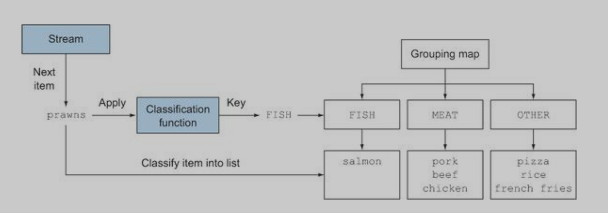

prawns: 捕捉

>The result of this grouping operation, shown in figure above, is a Map having as map key the value returned by the classification function and as corresponding map value a list of all the items in the stream having that classified value
>
>A key map to a list contain the same type of item

### 11.1 USE CUSTOM GROUPINGBY 

> If there is't a reference method that you need, your can custom the identify type that you want to groupingBy

**define the type want to grouping**

```java
public enum CaloriesLevel{
    FAT,NORMAL,DIET
}
```

**custome groupingBy**

```java
dishes.stream().collect(groupingBy(
	dish->{
        if(dish.getCalories()<400){
            return CaloriesLevel.DIET;
        }else if(dish.getCalories()<700){
            return Calories.NORMAL;
        }else{
            return Calories.FAT;
        }
    }
));
```

**eg. to seperate the Calories type**

```java
    @Test
    public void shout05() {
        Dishkind.DishKind meat = Dishkind.DishKind.MEAT;
        Dishkind.DishKind other = Dishkind.DishKind.OTHER;
        Dishkind.DishKind fish = Dishkind.DishKind.FISH;
        Dishkind.DishKind vegetable = Dishkind.DishKind.VEGETABLE;
        List<Dish> dishes = Arrays.asList(
                new Dish("fish", 20.5f, fish, 888.888),
                new Dish("pork", 30.8f, meat, 66.88),
                new Dish("cabbage", 10.5f, vegetable, 888.888),
                new Dish("chicken", 60.5f, meat, 99.88),
                new Dish("beef", 80.5f, meat, 999.88)
        );
        // use the custom groupingBy type
        System.out.println(dishes.stream().collect(groupingBy(
                dish -> {
                    if (dish.getCalories() < 400) {
                        return Dish.CaloriesLevel.DIET;
                    } else if (dish.getCalories() < 700) {
                        return Dish.CaloriesLevel.NORMAL;
                    } else {
                        return Dish.CaloriesLevel.FAT;
                    }
                }
        )));
    }
   
    // {FAT=[Dish{fee=20.5, name='fish', calories=888.888, dishkind=FISH}, 
    // Dish{fee=10.5, name='cabbage', calories=888.888, dishkind=VEGETABLE}, 
    // Dish{fee=80.5, name='beef', calories=999.88, dishkind=MEAT}], 
    // DIET=[Dish{fee=30.8, name='pork', calories=66.88, dishkind=MEAT},
    // Dish{fee=60.5, name='chicken', calories=99.88, dishkind=MEAT}]}
```


### 11.2 USE COUSTOM MULTIPLE-LEVEL GROUPINGBY METHOD 

>perform a two-level grouping, you can pass an inner groupingBy to the outer groupingBy
>
>make a inner groupingBy in outer groupingBy
>
>**you can consider the method in the collect is a collector which implement the interface collector **
>
>so if you want to grouping data by your own style, you can create a class that implement the collector interface

```java
    @Test
    public void shout06() {
        // achieve the grouping by multiple level
        Dishkind.DishKind meat = Dishkind.DishKind.MEAT;
        Dishkind.DishKind other = Dishkind.DishKind.OTHER;
        Dishkind.DishKind fish = Dishkind.DishKind.FISH;
        Dishkind.DishKind vegetable = Dishkind.DishKind.VEGETABLE;
        List<Dish> dishes = Arrays.asList(
                new Dish("fish", 20.5f, fish, 888.888),
                new Dish("pork", 30.8f, meat, 66.88),
                new Dish("cabbage", 10.5f, vegetable, 888.888),
                new Dish("chicken", 60.5f, meat, 99.88),
                new Dish("beef", 80.5f, meat, 999.88)
        );
        System.out.println(dishes.stream().collect(groupingBy(Dish::getDishKind, groupingBy(dish -> {
            if (dish.getCalories() < 400) {
                return Dish.CaloriesLevel.DIET;
            } else if (dish.getCalories() < 700) {
                return Dish.CaloriesLevel.NORMAL;
            } else {
                return Dish.CaloriesLevel.FAT;
            }
        }))));
    }
```

### 11.3 collectingAndThan in grouping

>If directory use menu.stream().collect(groupingBy(Dish::getType,maxBy(comparingInt(Dish::getCalories)))) to avoid the input data is null,the result is the Optional type;Because Optional will wrap the each data in stream, so in order to avoid it ,you can use collectingAndThen to get the maximun data and warp only one data in stream

```java
    @Test
    public void shout08() {
        // to the get highest calories' food in each type of food
        Dishkind.DishKind meat = Dishkind.DishKind.MEAT;
        Dishkind.DishKind other = Dishkind.DishKind.OTHER;
        Dishkind.DishKind fish = Dishkind.DishKind.FISH;
        Dishkind.DishKind vegetable = Dishkind.DishKind.VEGETABLE;
        List<Dish> dishes = Arrays.asList(
                new Dish("fish", 20.5f, fish, 888.888),
                new Dish("pork", 30.8f, meat, 66.88),
                new Dish("cabbage", 10.5f, vegetable, 888.888),
                new Dish("chicken", 60.5f, meat, 99.88),
                new Dish("beef", 80.5f, meat, 999.88)
        );
        System.out.println(dishes.stream().collect(groupingBy(Dish::getDishKind, collectingAndThen(maxBy(
                Comparator.comparingDouble(Dish::getCalories)), Optional::get)
        )));
    }
```

### 11.4  grouping data with mapping

**using mapping :**flexible grouping

```java
@Test
public void shout09() {
    // Using the mapping to grouping data from one type to another type
    Dishkind.DishKind meat = Dishkind.DishKind.MEAT;
    Dishkind.DishKind other = Dishkind.DishKind.OTHER;
    Dishkind.DishKind fish = Dishkind.DishKind.FISH;
    Dishkind.DishKind vegetable = Dishkind.DishKind.VEGETABLE;
    List<Dish> dishes = Arrays.asList(
            new Dish("fish", 20.5f, fish, 888.888),
            new Dish("pork", 30.8f, meat, 66.88),
            new Dish("cabbage", 10.5f, vegetable, 888.888),
            new Dish("chicken", 60.5f, meat, 99.88),
            new Dish("beef", 80.5f, meat, 999.88)
    );
    System.out.println(dishes.stream().collect(
            groupingBy(Dish::getDishKind, mapping(Dish::CaloriesType, toSet()))));

}
// {VEGETABLE=[FAT], MEAT=[DIET, FAT], FISH=[FAT]}
```

### 11.5 toCollection

 **There can not gurantees that the return type of set,  you can use the toCollection way to passing a construct reference method to it**

**eg. HashSet::new** // can use BiFunction to wrap it

```java
@Test
public void shout10() {
    Stream<Dish> empty = Stream.empty();
    // System.out.println(empty.collect(groupingBy(Dish::getCalories, mapping(Dish::CaloriesType, toSet()))));
    System.out.println(empty.collect(groupingBy(Dish::getCalories, mapping(
            Dish::CaloriesType, toCollection(HashSet::new)))).get(null).getClass());
}
```

**package the code**

>封装Collector方法

```java
//     Initial the collector to achieve the division of the calories
public static CaloriesLevel CaloriesType(Dish dish) {
    if (dish.getCalories() < 400) {
        return Dish.CaloriesLevel.DIET;
    } else if (dish.getCalories() < 700) {
        return Dish.CaloriesLevel.NORMAL;
    } else {
        return Dish.CaloriesLevel.FAT;
    }
}
```

```java
System.out.println(dishes.stream().collect(groupingBy(Dish::getDishKind, groupingBy(Dish::CaloriesType))));
```

## 12 COSTOM THE COLLECTOR CLASS

```java

package com.CustomerCollector;

import java.util.ArrayList;
import java.util.EnumSet;
import java.util.List;
import java.util.Set;
import java.util.function.*;
import java.util.stream.Collector;

// define a collector that group the data by Id and get each student's total scores
// The core of the collector is the BiConsumer function to group the raw data and divided it into several part,and you can change the data's status in this time ,such as get the summarization of data;
// Note that it is needed to return the data type is A,T; which type A mean the container to store the data processed by accumulator and type T is the raw data's type
public class CustomerCollector implements Collector<Student, List<Student>, List<Student>> {
    // supply   the container that store the data process  accumulator
    // you can chose a container that fit the programe,such as Set::new,in Set data structure data should be distinct
    @Override
    public Supplier<List<Student>> supplier() {
        return ArrayList::new;
    }

    // Core of the collector, collect the student data into specific List
    // here is to get the total scores of student
    @Override
    public BiConsumer<List<Student>, Student> accumulator() {
        return (l, e) -> {
            Predicate<Student> distinctStudent = student -> student.getId().equals(e.getId());
            boolean ifAdd = l.stream().noneMatch(distinctStudent);
            if (ifAdd) {
                // if there is not exits a student in list, set the student data to total, else add the course's score straightly
                // achieve the function of lazy realize
                e.setCourse(Student.Course.TOTAL);
                l.add(e);
            } else {
                l.stream().filter(distinctStudent).forEach(student -> student.setScore(student.getScore() + e.getScore()));
            }

        };
    }

    @Override
    public BinaryOperator<List<Student>> combiner() {
        return null;
    }

    @Override
    public Function<List<Student>, List<Student>> finisher() {
        return Function.identity();
    }

    @Override
    public Set<Characteristics> characteristics() {
        return EnumSet.of(Characteristics.IDENTITY_FINISH);
    }
    // supplier that provide the container to store the data process by acc

}

```

**Init data and run the programe**

```java
@Test
public void shout00() {
    List<Student> students =
            Arrays.asList(new Student("1", Student.Course.ENGLISH, 78), new Student("1", Student.Course.LANGUAGE, 71),
                    new Student("1", Student.Course.MATHEMATICS, 82), new Student("2", Student.Course.ENGLISH, 69),
                    new Student("2", Student.Course.LANGUAGE, 66), new Student("2", Student.Course.MATHEMATICS, 46),
                    new Student("3", Student.Course.ENGLISH, 78), new Student("3", Student.Course.LANGUAGE, 88),
                    new Student("3", Student.Course.MATHEMATICS, 100), new Student("4", Student.Course.ENGLISH, 68),
                    new Student("4", Student.Course.LANGUAGE, 84), new Student("4", Student.Course.MATHEMATICS, 90),
                    new Student("5", Student.Course.ENGLISH, 74), new Student("5", Student.Course.LANGUAGE, 59),
                    new Student("5", Student.Course.MATHEMATICS, 87));
    System.out.println(students.stream().collect(new CustomerCollector()));
}
```

## 13 PARTITIONINGBY

==partition the data into two part, and use boolean key to grouping the data==

```
@Test
public void shout11() {
    Dishkind.DishKind meat = Dishkind.DishKind.MEAT;
    Dishkind.DishKind other = Dishkind.DishKind.OTHER;
    Dishkind.DishKind fish = Dishkind.DishKind.FISH;
    Dishkind.DishKind vegetable = Dishkind.DishKind.VEGETABLE;
    List<Dish> dishes = Arrays.asList(
            new Dish("fish", 20.5f, fish, 888.888),
            new Dish("pork", 30.8f, meat, 66.88),
            new Dish("cabbage", 10.5f, vegetable, 888.888),
            new Dish("chicken", 60.5f, meat, 99.88),
            new Dish("beef", 80.5f, meat, 999.88)
    );
    System.out.println(dishes.stream().collect(partitioningBy(Dish::ifHighCalories)));
}
```

### 13.1 ADVANTAGES OF THE PARTITIONLING

**you can achieve the same result by combine the flter and toList**

```java
System.out.println(dishes.stream().filter(Dish::ifHighCalories).collect(toList()));
```

**Multiple Partition**

```java
@Test
public void shout12() {
    // get the highest calories food of the each substreams
    System.out.println(initDish().stream().collect(partitioningBy(Dish::ifHighCalories, collectingAndThen(maxBy(
            Comparator.comparingDouble(Dish::getCalories)), Optional::get))));
}
```

**eg. to predicate a IntStream data's prime data and nonprime data** 

```java
  @Test
    public void shout13() {
        // partition number into prime and nonprime
//        ArrayList<Integer> res = IntStream.iterate(0, a -> a + 1).limit(5).boxed().collect(toCollection(ArrayList::new));
//        System.out.println(res);
        Predicate<Integer> ifPrime = new Predicate<Integer>() {
            // To predicate a number if a prime number
            @Override
            public boolean test(Integer num) {
                int start = 2;
                int end = (int) Math.sqrt(num);
                for (int i = start; i <= end; i++) {
                    if (num % i == 0) {
                        return false;
                    }
                }
                return true;
            }
        };

        IntSupplier FIB = new IntSupplier() {
            private int curValues = 1;
            private int preValues = 0;

            @Override
            public int getAsInt() {
                int oldValues = preValues;
                preValues = curValues;
                curValues = oldValues + preValues;
                return curValues;
            }
        };
        System.out.println(IntStream.generate(FIB).limit(20).boxed().collect(partitioningBy(ifPrime)));
    }
```

==Excellent Solution==

```java
public boolean isPrime(int candidate) {
    return IntStream.rangeClosed(2, (int) Math.sqrt(candidate)).noneMatch(
            i -> candidate % i == 0);
}
```

**Init a serial stream data and predicate if it is a prime data**

```java
@Test
public void shout15() {
    // supplier连续int数据生成器
    System.out.println(IntStream.generate(new IntSupplier() {
        int old = 0;
        @Override
        public int getAsInt() {
            return old++;
        }
    }).limit(20).boxed().collect(partitioningBy(this::isPrime)));
}
```

```java
@Test
public void shout16() {
    System.out.println(IntStream.iterate(0, a -> ++a).limit(21).boxed().collect(partitioningBy(
            this::isPrime, toList()
    )));
}
```

## 14 Collector Interface

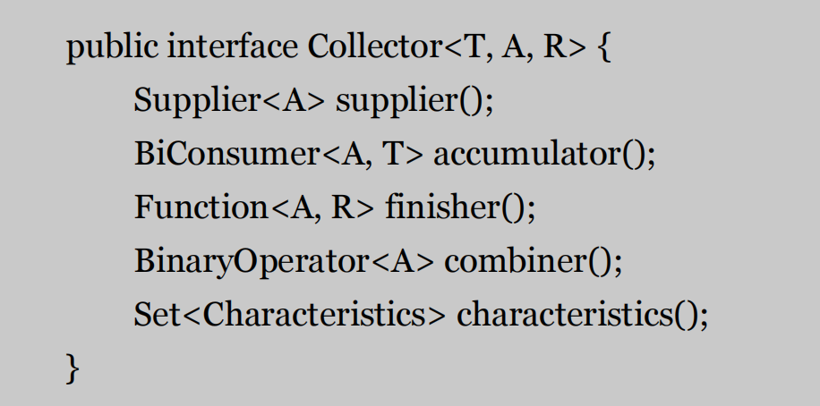


> **each of the first four methods return a function that will be invoked by the collect method, whereas the fifth one, characteristics, provides a set of characteristics that’s a list of hints used by the collect method itself to know which optimizations** 

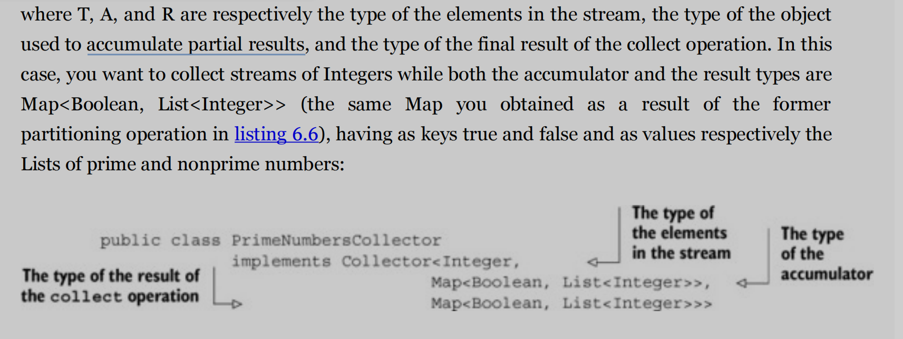

### 14.1 Supplier<A> supplier()

>making a new ==resullt container==
>
>The supplier method has to return a Supplier of an empty result—a parameterless function that
>
>when invoked creates an instance of an empty accumulator used during the collection process.
>
>This is a parameter function that return a empty accumulator

**eg. create a list container**

```java
public Supplier<List<T>> supplier() {
	return ArrayList::new;
}
```

### 14.2 BiConsumer<A, T> accumulator()

>**Adding an element to a result container**

**eg. traverse each element of the stream and add to stream**

```java
public BiConsumer<List<T>, T> accumulator() {
	return (list, item) -> list.add(item);
}

```

### 14.3 Function<A,R> finisher()

>==Applying the final transformation to the result container==
>
>// Collector<T,A,R>-> T--acumulator->A-finisher->R
>
>**The finisher method has to return a function that’s invoked at the end of the accumulation**
>
>**process, after having completely traversed the stream, in order to transform the accumulator**
>
>**object into the final result of the whole collection operation**

**eg. toList -> A type is instance R type ,so it is no need to   perform transformation,so the finisher method just has to return the identify function:**

```java
public Function<List<T>, List<T>> finisher() {
	return Function.identity();
}
```

==accumulator objector -> result objector==

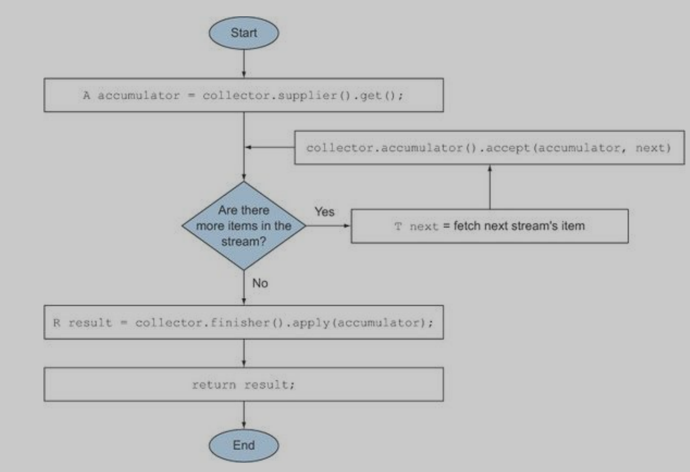

​	

### 14.4 BinaryOperator<A> combiner()

>**Merge  two result container**
>
>defines how the accumulators resulting from the reduction of different subparts of
>
>the stream are combined when the subparts are processed in parallel
>
>The addition of this fourth method allows a parallel reduction of the stream

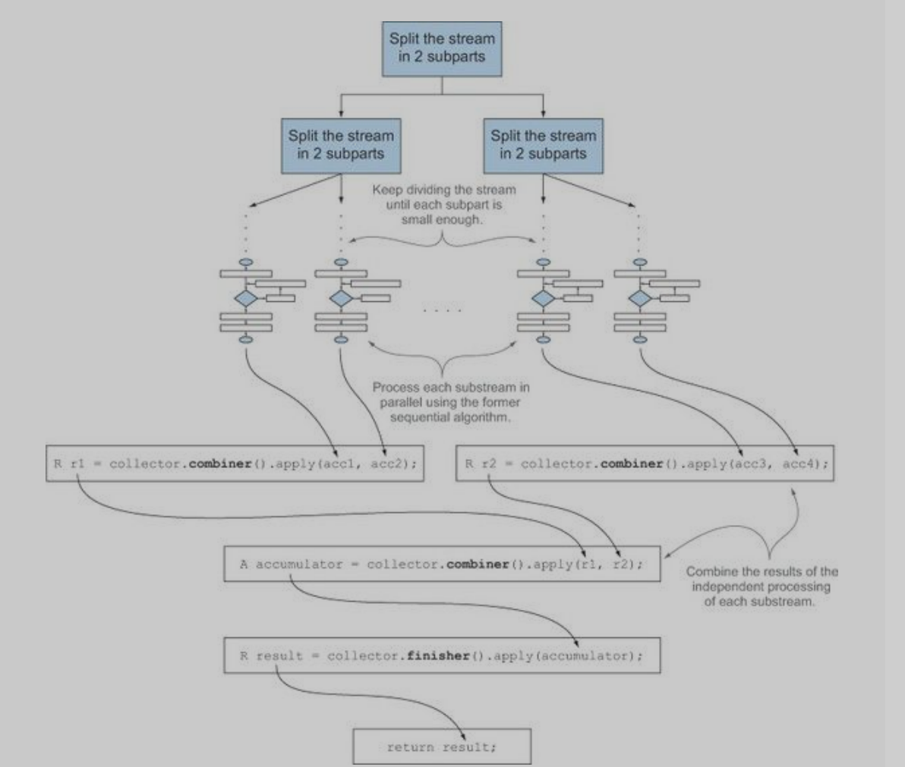

**eg. toList**

>put many accumulator (List<T>) into a result container (List<T>)

```java
public BinaryOperator<List<T>> combiner() {
return (list1, list2) -> {
	list1.addAll(list2);
	return list1; } }
```

### 14.5 Characteristics method

==Set<Characteristics> characteristics()==

>The last method, characteristics, returns an immutable set of Characteristics, defining the
>
>behavior of the collector—in particular providing hints about whether the stream can be reduced
>
>in parallel and which optimizations are valid when doing so. 
>
>

### 14.6 Enumberial Class Charateristics

// the stream will be processed in parallel only if its underlying data source is unordered

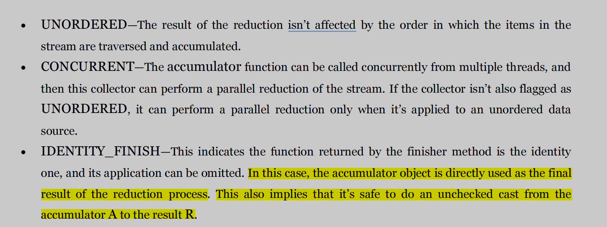

### 14.7 Without Implement Collector 

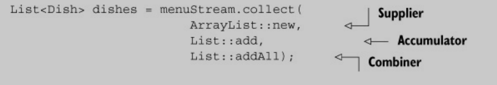

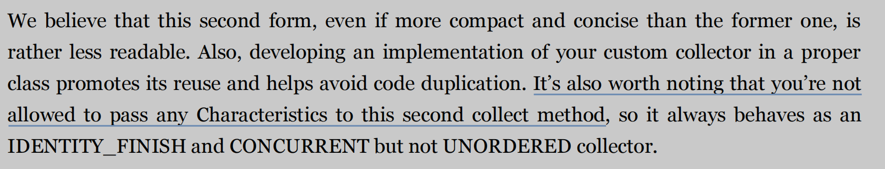

## 15 upDate the isPrime

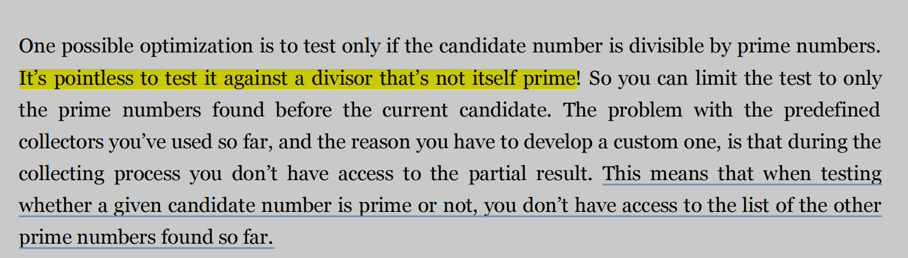

>So you need a way to stop testing whether the candidate is divisible by a prime as soon as the next prime is greater than the candidate’s; but Stream API can not achieve the function

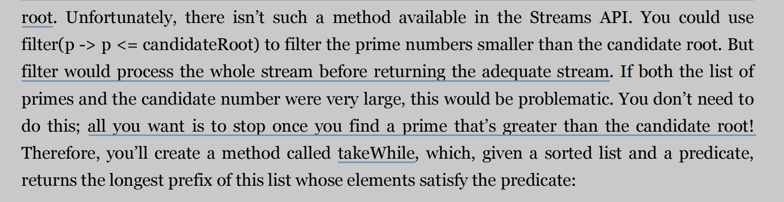

**Using a Prime list to predicate a giving number if a prime number**

```java
// Prime conclude a serial of prime number, and must have bigger than the squart of the cadidate number
public static <A> List<A> takeWhile(List<A> prime, Predicate<A> p) {
    int i = 0;
    for (A item : prime) {
        if (!p.test(item)) {
            return prime.subList(0, i);
        }
        ++i;
    }
    return prime;
}
// Using takeWhile to chose a list that conclude the biggest prime number should have in the prime list,and using nonmatch to predicate the cadidate if a prime number
public static boolean isPrime(List<Integer> prime, int candidate) {
    int candidateRoot = (int) Math.sqrt((double) candidate);
    return takeWhile(prime, i -> i <= candidate).stream().noneMatch(p -> candidate % p == 0);
}
```


## 16 develop  a collector 

==by implement the method of collector Interface==

```java
import java.util.*;
import java.util.function.BiConsumer;
import java.util.function.BinaryOperator;
import java.util.function.Function;
import java.util.function.Supplier;
import java.util.stream.Collector;

import static com.StreamTrain.StreamTrain.isPrime;

public class primeNumberCollector
        implements Collector<Integer,
        Map<Boolean, List<Integer>>,
        Map<Boolean, List<Integer>>> {

    @Override
    public Supplier<Map<Boolean, List<Integer>>> supplier() {
        return () -> new HashMap<Boolean, List<Integer>>() {{
            put(true, new ArrayList<Integer>());
            put(false, new ArrayList<Integer>());
        }};
    }

    @Override
    public BiConsumer<Map<Boolean, List<Integer>>, Integer> accumulator() {
        return (Map<Boolean, List<Integer>> acc, Integer candidate) -> {
            acc.get(isPrime(acc.get(true), candidate)).add(candidate);
        };
    }

    @Override
    public BinaryOperator<Map<Boolean, List<Integer>>> combiner() {
        return (Map<Boolean, List<Integer>> map1,
                Map<Boolean, List<Integer>> map2) -> {
            map1.get(true).addAll(map2.get(true));
            map1.get(false).addAll(map2.get(false));
            return map1;
        };
    }

    @Override
    public Function<Map<Boolean, List<Integer>>, Map<Boolean, List<Integer>>> finisher() {
        return Function.identity();
    }

    @Override
    public Set<Characteristics> characteristics() {
        return EnumSet.of(Characteristics.IDENTITY_FINISH);

    }
}

```

  **PartitoningBy VS Update PrimeNumberCollector**

```java

public class getPrimeNumber {
    public static void main(String[] args) {
        Scanner myScanner = new Scanner(System.in);
        System.out.println("Please input a candidate!");
        int n = myScanner.nextInt();
        System.out.println(IntStream.rangeClosed(2, n).boxed().collect(
                partitioningBy(getPrimeNumber::isPrime)));
        // System.out.println(IntStream.rangeClosed(2, n).boxed().collect(new primeNumberCollector()));
    }

    public static boolean isPrime(int candidate) {
        return IntStream.rangeClosed(2, (int) Math.sqrt(candidate)).noneMatch(
                i -> candidate % i == 0);
    }
}
```


