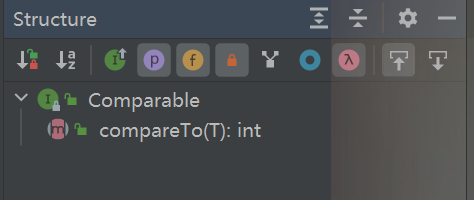

### Java Comparators接口和Comparable接口

---

### 1 相同点

Java的Comparator和Comparable当需要排序的集合或数组不是单纯的数字型时，通常可以使用Comparator或Comparable，以简单的方式实现对象排序或自定义排序。

可以实现自定义排序

### 2 不同点

comparable接口（排序接口）

Comparable接口是用于内部排序，可以实现基本数据类型的排序，缺点是需要修改源代码

Comparator接口是用于外部排序，一般用来实现没有实现Comparable接口的类的数据进行排序，新创建的Comparator类是一个比较器

Comparator接口

​	

==实现comparable接口需要对compareTo方法进行重载，对Comparator接口进行实例化需要对compare方法进行重载==

