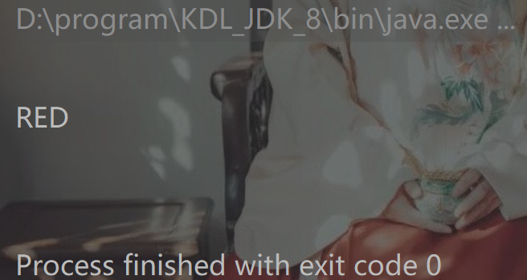

# Java Enum的七种常见的用法

---

1 创建常量

```java
    /*1 创建常量*/
    public enum Color{
        RED,YELLOW,BLUE;
    }
    
    @Test
    public void shout(){
        System.out.println(Color.RED);
    }
```




2 优化switch语句

// JDK1.6之前的switch语句只支持int,char,enum类型

// switch语句中支持的变量类型有 byte、short、int、char, 从 Java SE 7 开始，switch语句支持字符串 String 类型了，同时 case 标签必须为字符串常量或字面量。

```java
/*2 优化switch语句*/
    public void method2(Color a) {
        switch (a) {
            case RED:
                System.out.println(Color.RED);
                break;
            case BLUE:
                System.out.println(Color.BLUE);
                break;
            case YELLOW:
                System.out.println(Color.YELLOW);
                break;
            default:
                System.out.println("Null");
        }
    }
```

3 在枚举中定义方法

```java
    /*3 在枚举类中添加新方法*/
    public enum Color {
        RED("红色", 1), YELLOW("黄色", 2), BLUE("蓝色", 1);
        // 成员变量
        public String name;
        public int index;

        // 当枚举类中的数据类型不是单一的数据的时候，需要给指定变量提供构造器
        // 不提供相应构造器则无法创建相应的常量
        Color(String name, int index) {
            this.name = name;
            this.index = index;
        }

        // 普通方法
        public static String getName2(int index) {
            for (Color color : Color.values()) { // enum.values()->获取枚举类中的常量
                if (index == color.index) {
                    return color.name;
                }
            }
            return null;
        }

    }


    @Test
    public void shout() {
        System.out.println(Color.getName(2));
        System.out.println(getName2(2)); // 在枚举类外定义方法
    }
```

4 枚举类的方法重载

```java
toString、equals等
    
   public enum Color {  
    RED("红色", 1), GREEN("绿色", 2), BLANK("白色", 3), YELLO("黄色", 4);  
    // 成员变量  
    private String name;  
    private int index;  
    // 构造方法  
    private Color(String name, int index) {  
        this.name = name;  
        this.index = index;  
    }  
    //覆盖方法  
    @Override  
    public String toString() {  
        return this.index+"_"+this.name;  
    }  
}   
    
```

5 枚举类的继承接口

// 枚举类都是继承的java.lang.Enum类，由于Java的单继承特性，所以所有枚举类都无法继承其他类，但是可以实现其他接口

```java
public interface Behaviour {  
    void print();  
    String getInfo();  
}  
public enum Color implements Behaviour{  
    RED("红色", 1), GREEN("绿色", 2), BLANK("白色", 3), YELLO("黄色", 4);  
    // 成员变量  
    private String name;  
    private int index;  
    // 构造方法  
    private Color(String name, int index) {  
        this.name = name;  
        this.index = index;  
    }  
//接口方法  
    @Override  
    public String getInfo() {  
        return this.name;  
    }  
    //接口方法  
    @Override  
    public void print() {  
        System.out.println(this.index+":"+this.name);  
    }  
}  
```

6 使用接口组织枚举

```java
    /*4 使用接口组织枚举*/
interface Food {
    enum dessert implements Food {
        CAKE, MOON, FRUITS;
    }

    enum fruits implements Food {
        APPLE("苹果"), ORANGE("橙子"), GAPE("葡萄");
        public String name;

        fruits(String name) {
            this.name = name;
        }
    }

}

	@Test
    public void testEnum() {
        for (Food.fruits fruits : Food.fruits.values()) {
            System.out.println(fruits.name);
        }

```

7 枚举集合的运用


```java
java.util.EnumSet和java.util.EnumMap是两个枚举集合。EnumSet保证集合中的元素不重复；EnumMap中的 key是enum类型，而value则可以是任意类型。关于这个两个集合的使用就不在这里赘述，可以参考JDK文档。
```


8 枚举常量

// 类似于实例化常量

System.out.printlb(Student.XIAOMING);


