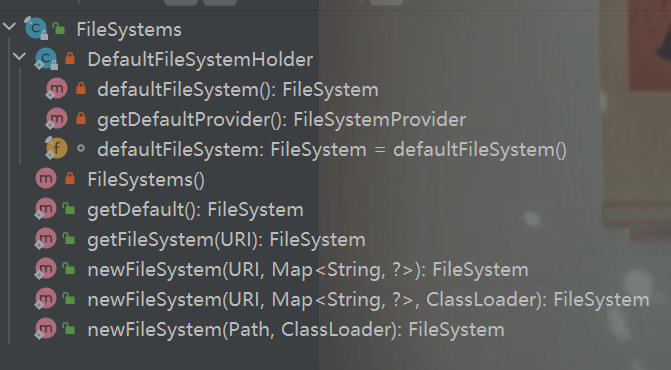

### Java FileSystems类

---

## 1 概述

```java
/**
 * Provides an interface to a file system and is the factory for objects to
 * access files and other objects in the file system.
 *该类是一个工厂方法，实现文件操作
 * <p> The default file system, obtained by invoking the {@link FileSystems#getDefault
 * FileSystems.getDefault} method, provides access to the file system that is
 * accessible to the Java virtual machine. The {@link FileSystems} class defines
 * methods to create file systems that provide access to other types of (custom)
 * file systems.
 *
 * <p> A file system is the factory for several types of objects:
 *
 * <ul>
 *   <li><p> The {@link #getPath getPath} method converts a system dependent
 *     <em>path string</em>, returning a {@link Path} object that may be used
 *     to locate and access a file. </p></li>
 *   <li><p> The {@link #getPathMatcher  getPathMatcher} method is used
 *     to create a {@link PathMatcher} that performs match operations on
 *     paths. </p></li>
 *   <li><p> The {@link #getFileStores getFileStores} method returns an iterator
 *     over the underlying {@link FileStore file-stores}. </p></li>
 *   <li><p> The {@link #getUserPrincipalLookupService getUserPrincipalLookupService}
 *     method returns the {@link UserPrincipalLookupService} to lookup users or
 *     groups by name. </p></li>
 *   <li><p> The {@link #newWatchService newWatchService} method creates a
 *     {@link WatchService} that may be used to watch objects for changes and
 *     events. </p></li>
 * </ul>
 * // 文件等级
 * <p> File systems vary greatly. In some cases the file system is a single
 * hierarchy of files with one top-level root directory. In other cases it may
 * have several distinct file hierarchies, each with its own top-level root
 * directory. The {@link #getRootDirectories getRootDirectories} method may be
 * used to iterate over the root directories in the file system. A file system
 * is typically composed of one or more underlying {@link FileStore file-stores}
 * that provide the storage for the files. Theses file stores can also vary in
 * the features they support, and the file attributes or <em>meta-data</em> that
 * they associate with files.
 *
 * <p> A file system is open upon creation and can be closed by invoking its
 * {@link #close() close} method. Once closed, any further attempt to access
 * objects in the file system cause {@link ClosedFileSystemException} to be
 * thrown. File systems created by the default {@link FileSystemProvider provider}
 * cannot be closed.
 *
 * <p> A {@code FileSystem} can provide read-only or read-write access to the
 * file system. Whether or not a file system provides read-only access is
 * established when the {@code FileSystem} is created and can be tested by invoking
 * its {@link #isReadOnly() isReadOnly} method. Attempts to write to file stores
 * by means of an object associated with a read-only file system throws {@link
 * ReadOnlyFileSystemException}.
 *
 // 具体的多线程文件操作看线程操作
 * <p> File systems are safe for use by multiple concurrent threads. The {@link
 * #close close} method may be invoked at any time to close a file system but
 * whether a file system is <i>asynchronously closeable</i> is provider specific
 * and therefore unspecified. In other words, if a thread is accessing an
 * object in a file system, and another thread invokes the {@code close} method
 * then it may require to block until the first operation is complete. Closing
 * a file system causes all open channels, watch services, and other {@link
 * Closeable closeable} objects associated with the file system to be closed.
 *
 * @since 1.7
 */
```

## 2 类定义

**FileSystem类是一个抽象类，实现了可关闭接口**

```java
public abstract class FileSystem
    implements Closeable
```

**构造器:仅存在一个无参构造器**

==Files() has private access in 'java.nio.file.Files==

该类是一个私有类，不支持在外面直接实例化

```java
    /**
     * Initializes a new instance of this class.
     */
    protected FileSystem() {
    }

```

## 3 类结构图



## 4 内部类：默认文件系统保持器（DefaultFileSystemHolder）

==静态内部类==

```java
// lazy initialization of default file system
对默认文件系统的延迟初始化
private static class DefaultFileSystemHolder {
    static final FileSystem defaultFileSystem = defaultFileSystem();

    // returns default file system
    // 构造方法实例化，使用单例设计模式
    private static FileSystem defaultFileSystem() {
        // load default provider
        FileSystemProvider provider = AccessController
            .doPrivileged(new PrivilegedAction<FileSystemProvider>() {
                public FileSystemProvider run() {
                    return getDefaultProvider();
                }
            });

        // return file system
        return provider.getFileSystem(URI.create("file:///"));
    }
```