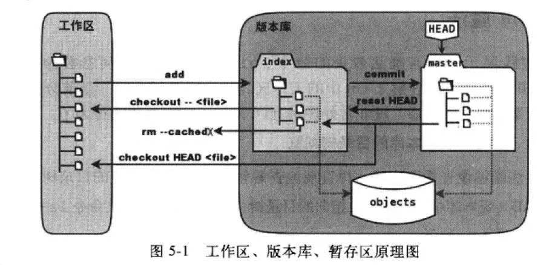

### Java Git 版本控制器

---

## 1 工作空间和文件状态



**工作区（Working Directory）**：工作目录->类似于文件夹下可以包含很多文件

**版本库（Repository）**：.git文件；其中index区域为暂存区，通过Git的add指令可以将工作区的文件加入到版本库的暂存区

**分支**：Git在初始化仓库的时候会自动创建一个master默认分支，代表的是目录树


## 2 常用指令

### 2.1 clone指定分支

```java
git clone -b BranchName RepositoryUrls
```

### 2.2  拉取指定分支（远程->本地）

```java
git pull origin remoteBranchName:LocalBranchName
```

2.3 清除暂存区文件

```java
// 直接清除仓库中index文件夹
rm .git/index
```


