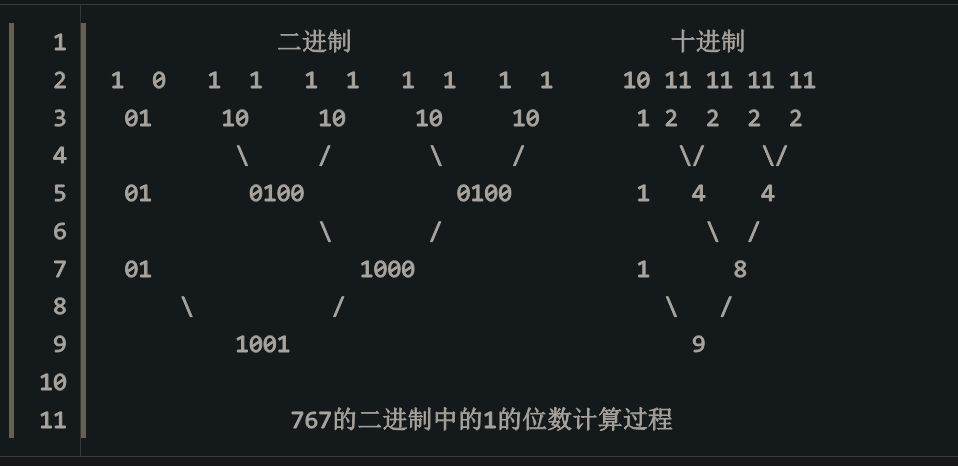

### Java Integer类

---

### 1 compare 方法

​	不需要再调用compareTo方法实现，直接实现两个整形数据的比较

```java
 	 /**
     * Compares two {@code int} values numerically.
     * The value returned is identical to what would be returned by:
     * <pre>
     *    Integer.valueOf(x).compareTo(Integer.valueOf(y))
     * </pre>
     *
     * @param  x the first {@code int} to compare
     * @param  y the second {@code int} to compare
     * @return the value {@code 0} if {@code x == y};
     *         a value less than {@code 0} if {@code x < y}; and
     *         a value greater than {@code 0} if {@code x > y}
     * @since 1.7
     */
    public static int compare(int x, int y) {
        return (x < y) ? -1 : ((x == y) ? 0 : 1);
    }
```

### 2 compareTo方法

```java
/**
     * Compares two {@code Integer} objects numerically.
     *
     * @param   anotherInteger   the {@code Integer} to be compared.
     * @return  the value {@code 0} if this {@code Integer} is
     *          equal to the argument {@code Integer}; a value less than
     *          {@code 0} if this {@code Integer} is numerically less
     *          than the argument {@code Integer}; and a value greater
     *          than {@code 0} if this {@code Integer} is numerically
     *           greater than the argument {@code Integer} (signed
     *           comparison).
     * @since   1.2
     */
	// 直接调用compare方法
    public int compareTo(Integer anotherInteger) {
        // compare 方法用於比較器
        return compare(this.value, anotherInteger.value);
    }
```

### 3 bitCount算法（人口算法）

// 计算int数据（底层二进制数据）的汉明重量

#### 3.1 普通方法

// 一次遍历数据中每一位数据，判断是否为1

// 算法时间复杂度为O(n)->其中n为数据的位数

```java
public int bitCount(int num){
    int count = 0;
    while(num > 0){
        if(num & 0b00000001 == 0b00000001){
            count++;
        }
		num = num >>> 1;// 逻辑右移,不考虑符号
    }
    return count;
}
```

#### 3.2 普通算法优化

// 使用num-1可以直接定位到num中1的位置

// 算法的时间复杂度为O(n)->其中n为num中1的个数

```java
public int bitCount(int num){
    int count = 0;
    while(num > 0){
     	num = (num - 1) & num;
        // 0b00011111 -> 0b00011111 - 1 -> 0b00011110 & 0b00011111 -> 0b00011110
        // 从左到右直接确定1的位置，通过num - 1实现将高位的1往地位的1走 
        count++;
    }
    return count;
}
```

#### 3.3 源码方法（算法的时间复杂度为O（1））

int类型数据最多可以表示的位数为32位，所以最大的范围为左边16为和右边16为，最终计算左边16位和右边16位中1的个数；1的个数从两位开始计算。



原始方法

```java
    public int repeatBitCount(int i) {
        // 32 bit 
        // Ox55555555 = 0b01010101010101010101010101010101‬ -> 计算相邻两位数字中1的个数
        // 左右各1位，只需要使用1bit就可以表示出数量 -> 01 + 01 = 10
        // 0x33333333 = ‭0b00110011001100110011001100110011‬ -> 计算相邻四位数字中1的个数
        // 左右各2位，需要使用2bit表示出数量 -> 010 + 010 = 100
        // 0x0f0f0f0f = 0b00001111000011110000111100001111 -> 计算相邻八位数字中1的个数
        // 左右各4位，需要使用3bit表示出数量 -> 0100 + 0100 = 1000
        // 0x00ff00ff = 0b00000000111111110000000011111111 -> 计算相邻十六位数字中1的个数
        // 左右各8位，需要使用4bit表示出数量 -> 01000 + 01000 = 10000
        // 0x00ff00ff = 0b00000000000000001111111111111111 -> 计算相邻三十二位数字中1的个数
        // 左右各16位，需要使用5bit表示出数量 -> 10000 + 10000 = 100000
        // 0x3f ‭      = 0b00111111‬ -> int最多可以表示32位数字即0b100000
        // 使用0x3f清除32为数字之外的数据
        i = (i & 0x55555555) + ((i >>> 1) & 0x55555555);
        i = (i & 0x33333333) + ((i >>> 2) & 0x33333333);
        i = (i & 0x0f0f0f0f) + ((i >>> 4) & 0x0f0f0f0f);
        i = (i & 0x00ff00ff) + ((i >>> 8) & 0x00ff00ff);
        i = (i & 0x0000ffff) + ((i >>> 16) & 0x0000ffff);
        // int数据只能表示32为数据，因此只需知道64为数据中右32为数据有多少个1即可
        return i & 0x3f;
    }
```

// 数据右移

将数据对半分，左边个数+右边个数 = 当前数据分组每组数据1的个数，i>>>1 每组2个数据进行判断先左，在将左边数据移动到右边判断

```java
0b0011 -> 0 0 | 1 1
```

原始方法优化

```java
第一步：两个bit计算1的数量：0b11: 0b01 + 0b01 = 0b10 = 2, 0b10: 0b00 + 0b01 = 0b01 = 1。研究发现：2=0b11-0b1，1=0b10-0b1,可以减少一次位于计算：i = i - ((i >>> 1) & 0x55555555)
    
第二步：暂时没有好的优化方法

第三步：实际是计算每个byte中的1的数量，最多8（0b1000）个，占4bit，可以最后进行位与运算消位，减少一次&运算：i = (i + (i >>> 4)) & 0x0f0f0f0f;实现了左边4个1和右边4个1相加

第四,五步：同上理由，可以最后消位。但是由于int最多32（0b100000）个1，所以这两步可以不消位，最后一步把不需要的bit位抹除就可以了：i & 0x3f
```

优化后的bitCount

```java
public int bitCount(int i){
    i = i - ((i >>> 1) & 0x55555555);
    i = i - ((i >>> 2) & 0x33333333);
    i = (i + (i >>> 4)) & 0x0f0f0f0f;
    i = i + (i >>> 8); // 0b00001111 -> 0000可以表示16个1所以，00001111可以将表示左4位和右4位中1的个数和0100 + 0100 = 1000 = 8
    // 当左8+右8 -> 00001000 + 00001000 = 00010000 = 16 ->表示左边有16个数右边有16个数
    i = i + (i >>> 16);
    return i & 0x3f;
}
```


