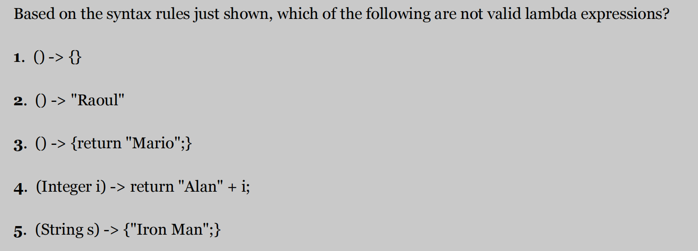

#### Java Lambda表达式

---

## 1 lambda表达式格式




## 2 Lambda表达式与局部变量

- Lambda表达式可以被允许获取实例化对象和静态变量，但是访问局部变量时局部变量必须是显式声明为final或者是effective final 
- 

- ​	Lambda表示式可以直接修改实例化对象值和静态变量的值

  ```java
  public void shout02() {
      People xiaoMing = new People("小明", 18);
      Runnable r = () -> {
          //System.out.println(xiaoMing.age);
          // xiaoMing.setAge(20);
          xiaoMing.age = 20;
          System.out.println(xiaoMing.age);
      };
      r.run();
  }
  ```

  ```
  // public static portNumber = 2032;
  public void shout03() {
      Runnable r = () -> {
          portNumber = 3306;
          System.out.println(portNumber);
      };
      r.run();
  }
  ```

- ​	Lambda表示式可以访问非final的局部变量，但是不可以使用lambda表示式内的方法修改局部变量的值，但是可以使用外部方法实现变量值的修改

  ```
  public void shout04() {
      int tmp = 1111;
      Runnable r = () -> {
          System.out.println(tmp);
      };
      r.run();
  }
  ```


