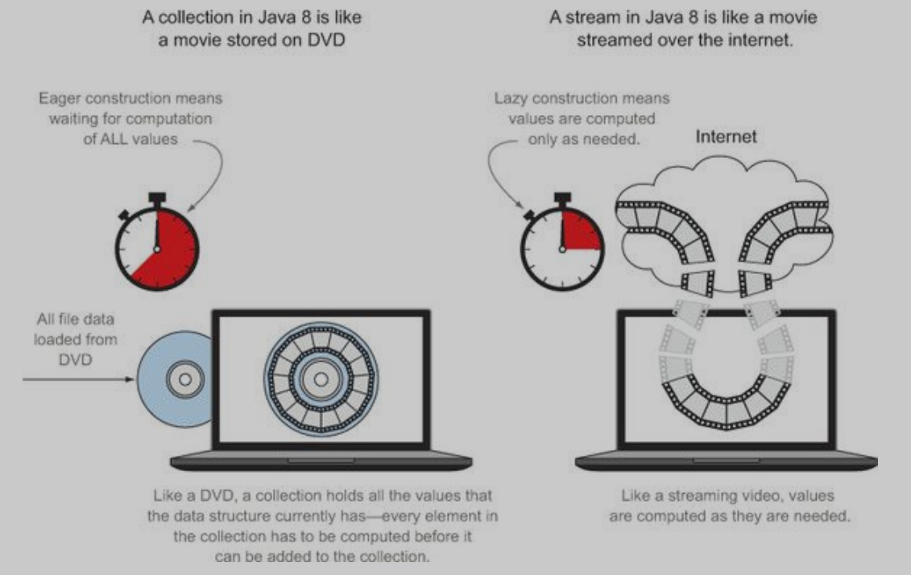
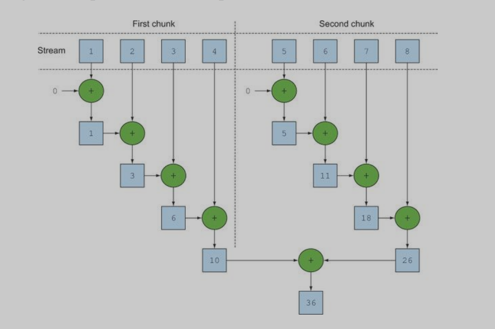
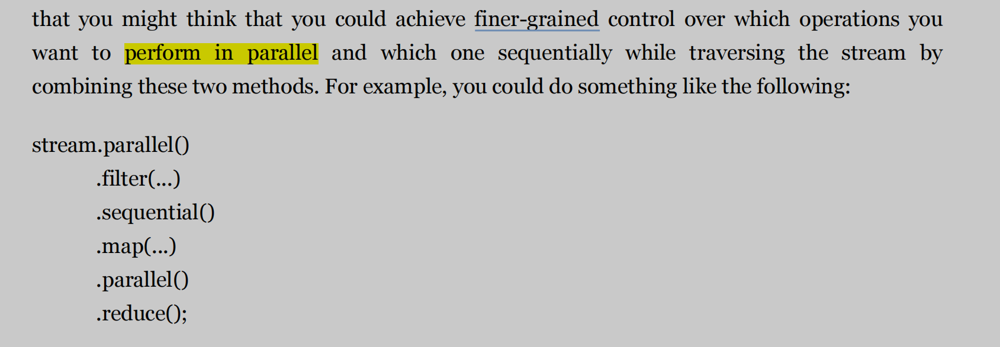

#### sxJava Stream

---

==you can think of them as fancy iterators over a collection of data==

## 1 使用Stream实现流数据的筛选

```java
// 使用枚举类记录各种菜系
enum DishKind{
    MEAT,FISH,OTHER  
}

// The class of dish,to record the calories of the dish
// -*- coding: utf-8 -*- 
/**
 * Project: Java8InActionT
 * Creator: yanking
 * Create time: 2022-01-15 17:22
 * IDE: IntelliJ IDEA
 * Introduction:
 */
package com.StreamTrain;


import java.util.ArrayList;
import java.util.List;


// The class of dish,to record the calories of the dish
public class Dish implements Comparable<Dish> {
    private Float fee;
    private String name;
    private Double calories;
    private Dishkind.DishKind dishkind;


    public Dish() {

    }

    public Dish(String name, Float fee, Dishkind.DishKind dishKind, Double calories) {
        this.name = name;
        this.fee = fee;
        this.dishkind = dishKind;
        this.calories = calories;
    }

    // 创建方法实现快速大量实例化对象的创建
    public static <S, T, U, R, D> List<D> map(S[] name, T[] fee, U[] dishkind, R[] calories, fFunction<S, T, U, R, D> fs) {
        List<D> res = new ArrayList<>();
        int len = name.length;
        for (int i = 0; i < len; ++i) {
            res.add(fs.apply(name[i], fee[i], dishkind[i], calories[i]));
        }
        return res;
    }

    public Float getFee() {
        return fee;
    }

    public void setFee(Float fee) {
        this.fee = fee;
    }

    public String getName() {
        return name;
    }

    public void setName(String name) {
        this.name = name;
    }

    public Double getCalories() {
        return calories;
    }

    public void setCalories(Double calories) {
        this.calories = calories;
    }

   /* public Dish(String name, float fee, Dishkind dishkind, double calories) {
        this.name = name;
        this.fee = fee;
        this.dishkind = dishkind;
        this.calories = calories;
    }*/

    public Dishkind.DishKind getDishkind() {
        return dishkind;
    }

    public void setDishkind(Dishkind.DishKind dishkind) {
        this.dishkind = dishkind;
    }

    @Override
    public int compareTo(Dish o) {
        return (int) (this.calories - o.calories);
    }

    @Override
    public String toString() {
        return "Dish{" +
                "fee=" + fee +
                ", name='" + name + '\'' +
                ", calories=" + calories +
                ", dishkind=" + dishkind +
                '}';
    }

    // 实例化接口创建
    public interface fFunction<S, T, U, R, D> {
        // 使用前面四个参数实现D类型对象的实例化
        D apply(S s, T t, U u, R r);
    }
}


```

// 方法实现

```java
  @Test
    public void shout() {
        // 批量实例化Dish对象
        String[] name = {"fish", "pig", "chicken"};
        Float[] fee = {20f, 28f, 50f};
        Dishkind.DishKind[] dishkinds = {Dishkind.DishKind.FISH, Dishkind.DishKind.MEAT, Dishkind.DishKind.OTHER};
        Double[] calories = {66.0, 88.8, 99.9};
        List<Dish> dishes = Dish.map(name, fee, dishkinds, calories, Dish::new);
        dishes.stream().filter((a) -> a.getFee() > 20).forEach(System.out::println);
    }
```

## 2 Stream Vs Collection

### 2.1 Concept



==Collection==: // 集合中的数据是全部计算好才放入集合中 (Egerly Constructed)

> A collection is an in-memory data structure that holds all the values the data structure currently has—every element in the collection has to be computed before it can be added to the collection

==Stream==:	// 流文件中的数据是随取随算，并不需要计算完在放入数据结构中（Laziluy Constructed）

>The idea is that a user will extract only the values they require from a stream, and these elements are produced—invisibly to the user—only as and when required

### 2.2 Difference

**Stream** is like a iterator which just can be tranversable by one time

Stream数据只能被遍历一次

**Iterator's Difference**

- External Iterator(Collection)
- Internal Iterator(Stream)

### 2.3 Stream 中Intermediate operation and terminal operation

==Intermediate operation==

>Intermediate operations such as filter and map return a stream and can be chained together. They’re used to set up a pipeline of operations but don’t produce any result.
>
>The operation concert a stream into another stream

==Terminal Operation==

> Terminal operations such as forEach and count return a nonstream value and process a stream pipeline to return a result.(Produce a final result)

### 2.4 Stream 中的map（映射）方法

==map==

A Stream method to Extract the element data of stream

==flapmap==

​	Arrays::Stream ：make a array stream into a element stream，put mutiple dimention data into 

one dimention 

​	eg. Stream[] String -> String

**实现字符串数组中独立字母输出**

```java
Stream.of("Hello", "world").map(
    a -> a.split("")).flatMap(Arrays::stream).distinct().collect(
    Collectors.toList()).forEach(System.out::print);
```

**实现列表数字随机组合**

```java
List<Integer> a = Arrays.asList(1, 2, 3);
List<Integer> b = Arrays.asList(4, 5);
// 实现两个列表之间的自由组合
a.stream().map(i -> i < 4).forEach(System.out::println);
List<int[]> res = a.stream().flatMap(i -> b.stream().map(j -> new int[]{i, j})).collect(Collectors.toList());

// new int[] 在不同位置的实现
 List<int[]> res = a.stream().flatMap(i -> b.stream().map(j -> new int[]{i, j})).filter(k->(k[0]+k[1])%3==0).collect(Collectors.toList());
```

### 2.5  ==reduce==  in Stream structure

**In order to fold the source data by iterator function**

// the function to get maximum

```java
    public void shout10() {
        List<Integer> a = Arrays.asList(1, 2, 3, 88, 76, 55, 66, 88);
        System.out.println(a.stream().reduce(Math::max).get());
    }
```

// thr function to get summarize

```java
Use Lambda 
	public void shout11() {
        List<Integer> a = Arrays.asList(1, 2, 3, 88, 76, 55, 66, 88);
        System.out.println(a.stream().reduce(Integer::sum).get());
    }
Use annonymous class
    public void shout11() {
 System.out.println(Stream.of(1, 2, 3, 4, 5).reduce(0, new BinaryOperator<Integer>() {
            @Override
            public Integer apply(Integer integer, Integer integer2) {
                return integer + integer2;
            }
        }));
    }

```

**the initial value of reduce **

- 用于应对传入数据源为空的情况
- 传入初始值则表示reduce会根据初始值对数据进行折叠操作（使用内部迭代器）

eg.

```java
    @Test
    public void shout12() {
        List<Integer> a = Arrays.asList(1, 2, 3, 88, 76, 55, 66, 88);
        System.out.println(a.stream().reduce(-379, Integer::sum));
    }
```

### 2.6 practice

**dataSet**

```java
@Test
public void shout() {
    // sort the transaction's date by stream way!
    Trader raoul = new Trader("Raoul", "Cambridge");
    Trader mario = new Trader("Mario", "Milan");
    Trader alan = new Trader("Alan", "Cambridge");
    Trader brian = new Trader("Brian", "Cambridge");
    List<Transaction> transactions = Arrays.asList(
        new Transaction(brian, 2011, 300),
        new Transaction(raoul, 2012, 1000),
        new Transaction(raoul, 2011, 400),
        new Transaction(mario, 2012, 710),
        new Transaction(mario, 2012, 700),
        new Transaction(alan, 2012, 950)
    );
```

**classSet**

// Trader

```java

package com.StreamTrain.transaction;

public class Trader {
    private final String name;
    private final String city;


    public Trader(String name, String city) {
        this.name = name;
        this.city = city;
    }

    public String getName() {
        return name;
    }

    public String getCity() {
        return city;
    }


    @Override
    public String toString() {
        return "Trader{" +
                "name='" + name + '\'' +
                ", city='" + city + '\'' +
                '}';
    }
}

```

// Transaction

```java
package com.StreamTrain.transaction;

public class Transaction {
    private final Trader trader;
    private final int year;
    private final int value;

    public Transaction(Trader trader, int year, int value) {
        this.trader = trader;
        this.year = year;
        this.value = value;
    }


    public Trader getTrader() {
        return trader;
    }

    public int getYear() {
        return year;
    }

    public int getValue() {
        return value;
    }

    @Override
    public String toString() {
        return "Transaction{" +
                "trader=" + trader +
                ", year=" + year +
                ", value=" + value +
                '}';
    }

}
```

**1**. Find all transactions in the year 2011 and sort them by value (small to high).

```java
transactions.stream().sorted(                Comparator.comparing(Transaction::getValue)).forEach(System.out::println);
    }
```

**2**. What are all the unique cities where the traders work?

```
transactions.stream().map(Transaction::getTrader).map(
	Trader::getCity).distinct().forEach(System.out::println);
```

**3**. Find all traders from Cambridge and sort them by name.

```java
 transactions.stream().map(Transaction::getTrader).filter(a-> a.getCity().distinct().equals("Cambridge")).sorted(Comparator.comparing(Trader::getName)).forEach(System.out::println);

// Answer
String res = transactions.stream().map(t -> t.getTrader().getName()).sorted().reduce("", (n1, n2) -> n1 + n2);

// use join
String res = transactions.stream().map(t -> t.getTrader().getName()).sorted().reduce(joining());

```

**4**. Return a string of all traders’ names sorted alphabetically.

```java
transactions.stream().map(Transaction::getTrader).map(Trader::getName).distinct().sorted(String::compareTo).forEach(System.out::println);
       
// false
transactions.stream().map(Transaction::getTrader).map(Trader::getName).distinct().sorted(Comparator.comparing(Trader::getName)).forEach(System.out::println);
// pin that the method in the comparing should be static
```

```java
Comparator.comparing(Trader::getName)的使用一般出现在数据是一个类对象，对象中出现了比较多的属性，此时需要选择对象的其中一个属性进行比较
但是当对象只有一个属性的时候，只需要直接使用Java值内置的比较方法即可完成比较
    类似于：Integer::CompareTo、 String::CompareTo
```

**5**. Are any traders based in Milan?

//  use thr method of filter + findany + ifpresent

// if there no a  trader  base in the millian,the function will return nothing 

```java
        // Use stream to check if there has trader base in millan
transactions.stream().map(Transaction::getTrader).filter(
    a -> a.getCity().equals("Milan")).findAny().ifPresent(d -> System.out.println(d.getName()));

// findany 返回的是流中任意一个符合条件的数据
// allMatch 会对整个流的数据进行匹配，检验是否全部数据符合当前条件
// anyMatch 对流中数据进行匹配，当流中存在符合条件的数据则返回trues
// findfirst 返回流中第一个符合条件的数据
transactions.stream().map(Transaction::getTrader).distinct().filter(
    a -> a.getCity().equals("Milan")).forEach(System.out::println);

// Answer
System.out.println(transactions.stream().anyMatch(t -> t.getTrader().getCity().equals("Milan"))

```

**6**. Print all transactions’ values from the traders living in Cambridge.

```java
//  Print all transactions’ values from the traders living in Cambridge.
transactions.stream().filter(a -> a.getTrader().getCity().equals("Cambridge")).map(
        Transaction::getValue).forEach(k -> System.out.print(k + "\t"));
```

**7**. What’s the highest value of all the transactions?

```java
//  What’s the highest value of all the transactions?
System.out.println(transactions.stream().map(Transaction::getValue).reduce(Math::max).get());
```

**8**. Find the transaction with the smallest value.

```java
//  Find the transaction with the smallest value.
System.out.println(transactions.stream().min(Comparator.comparing(Transaction::getValue)).get());
System.out.println(transactions.stream().sorted(Comparator.comparing(Transaction::getValue)).findFirst().get());
```


## 3 Primitive Stream(基本数据流)

// int float double String ...    ->numeric stream -> 指定类型流

**Goal**: Avoid the hidden boxing cost

**Method**: boxing <--> unboxing   -> 可以实现包装类和废包装类之间流的转换

==unboxing==

- ​	maptoInt
- ​    maptoDouble
- ​    ...

==boxing==

​	流数据处理方法，将基本数据类型封装为包装类例如：int -> Integer

- intStream.boxed()
- doubleStream.boxed()
-  ...	

### 3.1 整形数据流（IntStream） // 实现对整形数据的流处理方式

==数据范围选取：==**rangeClosed**,范围是一个左闭右闭（左闭右开）区间

```java
IntStream.rangeClosed（range）(1,100) -> num in 1 to 99
```

 **使用整形流生成 [1-100] 内的勾股数**

```java
IntStream.rangeClosed(1,100).boxed().flatMap(a->IntStream.rangeClosed(a,100).filter(b->Math.sqrt(a*a+b*b)%1==0).mapToObject(b->new int[] {a,b,(int)Math.sqrt(a*a+b*b)}))
```

>boxed：
>
>​	将基本数据类型封装为包装类型数据
>
>flatMap:
>
>​	多维数据转化为一维数据
>
>mapToObject:
>
>​	Lambda表达式中将基本int[] 数据转化为int类型返回

**A new way to avoid to calculate the sqrt method twice**

```java
IntStream.rangeClosed(1,100).boxed().flatMap(a->IntStream.rangeClosed(a,100).mapToObject(b->new double[]{a,b,Math.sqrt(a*a+b*b)}).filter(t->t[2]%1==0));
```

==boxing&&unboxing之间的区别==

>1 使用intStream可以避免系统隐藏的解包装操作
>
>2 collect(Collectors.toList)转化为List数据结构的时候需要数据为包装类

```java
Stream.of(1, 2, 3).mapToInt(a -> a).boxed().forEach(System.out::println);
```

```java
Integer a = 1;
Integer b = 1;
System.out.println(a + b);
Integer c = a + b;
int d = a + b;
System.out.println(c.getClass());
System.out.println(d);
```

**直接创建流方法**

### 3.2 数组转化为流文件方法

```java
 Arrays.Stream()
```

### 3.3 创建空流

```java
Stream.empty()
```

### 3.4 Files中的Stream操作

==Files.lines:==调用了BufferReader包装类，使用Stream结构读取数据

// 读取指定文件中的数据并且计算其中不同单词的个数

// Files.lines调用BufferReader对文件进行读取并且使用流数据结构进行读取，读取数据的多少根据流的损耗进行补充

```java
 public void shout02() throws IOException {
        // USE NIO API NO-BLOCKED I/O API  TO GET THE  DATA OF A FILE
        String txtPath = "F:\\Java_idea\\LanQiao\\src\\TBinaryAdd\\data.txt";
        long count = Files.lines(Paths.get(txtPath), Charset.defaultCharset()).flatMap(
                lines -> Arrays.stream(lines.split(" "))).distinct().count();
    }
```

### 3.5 无限流（Infinite Stream）

> 如果有无限的数据（或者可迭代的数据），可以使用特定的流迭代器和流生成器不断生成流数据文件，这种流被称为无线流一般使用limit方法限制流的大小，从而避免对流数据的无限读取

**Stream iterate:**

>流生成迭代器
>
> 使用lambda表达式迭代数据生成无限流，数据之间具有一定的联系

eg.

```java
Stream.iterate(0,n->n+2).limit(5)
```

eg. Use Infinite Stream to generate the ==Fibonacci tuples series==

```java
Stream.iterate(new int[]{0, 1}, t -> new int[]{t[1], t[0] + t[1]}).limit(20).forEach(a -> System.out.print("(" + a[0] + "," + a[1] + ")"));
```


**Stream generate:**

>流生成器
>
>使用Lambda表达式生成新数值，新的数值之间没有必要的关系

```java
 Stream.generate(Math::random).limit(5).forEach(a -> System.out.print(a + "\t"));
```

### 3.6  Lambda&&Anonymous Class

>But the difference between the anonymous class used here and a lambda is that the anonymous class can define state via fields, which the getAsInt method can modify. This is an example of a side effect. All lambdas you’ve seen so far were side-effect free; they didn’t change any state.
>
>匿名内部类通过定义字段（Files）（重载方法）实现对state的变更，而Lambda表达式不会改变任何状态参量

```java
@Test
public void shout09() {
    IntStream one = IntStream.generate(() -> 1).limit(1);
    IntStream two = IntStream.generate(() -> 2).limit(1);
    IntStream third = IntStream.generate(new IntSupplier() {
        @Override
        public int getAsInt() {
            return 3;
        }
    }).limit(1);
    one.forEach(System.out::println);
    two.forEach(System.out::println);
    third.forEach(System.out::println);
}
```

**state hold && state modify**

>状态保持和状态改变：
>
>​		Lambda表示式不会改变原先状态，即：生产之后就自由了
>
>​		Anonymous class可以通过自定义字段实现状态记录并且修改原先状态，即：生产之后还受限制

eg.

```java
    @Test
    public void shout10() {
        // 状态修改和状态保持
        IntSupplier FIB = new IntSupplier() {
            int preValues = 0;
            int curValues = 1;
            int oldValues = 0;

            @Override
            public int getAsInt() {
                oldValues = preValues;
                preValues = curValues;
                curValues = oldValues + curValues;
                return curValues;
            }
        };
        IntStream.generate(FIB).limit(20).forEach(a -> System.out.print(a + "\t"));
    }

```

## 4 Collect in Stream

### 4.1 冗杂的账单分类操作

// 创建数据

```java
@Test
public void shout01() {
    // 按照货币的类型对订单进行分类
    transactions.currency Y = transactions.currency.YUAN;
    transactions.currency D = transactions.currency.DOLLARS;
    transactions.currency G = transactions.currency.GOLD;
    List<transactions> transactions = Arrays.asList(
            new transactions(Y, 568.568),
            new transactions(Y, 999.568),
            new transactions(Y, 888.568),
            new transactions(Y, 666.568),
            new transactions(D, 123.123),
            new transactions(G, 888.888)
    );
}
```

// V 0.1

```java
// grouping
    HashMap<com.GroupByCollect.transactions.currency, List<com.GroupByCollect.transactions>> currencyListHashMap =
            new HashMap<>();
    for (transactions transaction : transactions) {
        transactions.currency currency = transaction.getCurrency();
        List<com.GroupByCollect.transactions> transactionConcurrency = currencyListHashMap.get(currency);
        if (transactionConcurrency == null) {
            transactionConcurrency = new ArrayList<>();
            currencyListHashMap.put(currency, transactionConcurrency);
        }
        transactionConcurrency.add(transaction);
    }

```

// V0.2

```java
  // computeIfAbsent方法简化的代码量
        HashMap<com.GroupByCollect.transactions.currency, List<com.GroupByCollect.transactions>> currencyListHashMap =
                new HashMap<>();
        for (transactions transaction : transactions) {
            transactions.currency currency = transaction.getCurrency();
            List<com.GroupByCollect.transactions> transactionConcurrency = currencyListHashMap.computeIfAbsent(currency, k -> new ArrayList<>());
            transactionConcurrency.add(transaction);
        }
```

// 简化版操作==使用Stream中的collect方法==

```java
Map<transactions.currency, List<transactions>> res =
    tts.stream().collect(groupingBy(transactions::getCurrency));
```

## 5 Parallel Streams

>A *parallel* stream is a stream that splits its elements into multiple chunks, processing each chunk with a different thread. Thus, you can automatically partition the workload of a given operation on all the cores of your multicore processor and keep all of them equally busy




### 5.1 Sequential & Parallel



>**But the last call to parallel or sequential wins and affects the pipeline globally. In this example,**
>
>**the pipeline will be executed in parallel because that’s the last call in the pipeline.**
>
>==it mean that if the last call is the sequential method,the pipeline will be executed in sequential== 


### 5.2 configuring the thread pool used by parallel streams

>==Parallel stream internally use the default ForkJoinPool,which by default has as many threads as you have processors==
>
>
>
>

```
@Test
public void shout18() {
    System.out.println(Runtime.getRuntime().availableProcessors());  // 4
    System.setProperty("Runtime.getRuntime().availableProcessors()","12");
}
```

###  


