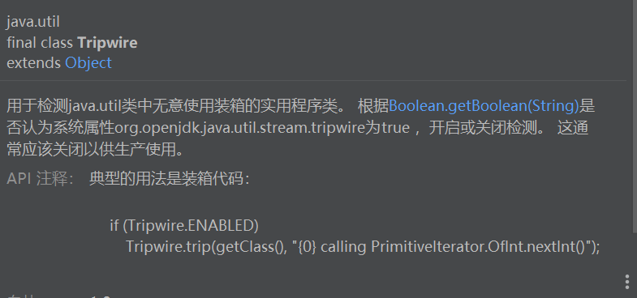

## Java Tripwire类

---

## 1 概述



```
/**
 * Utility class for detecting inadvertent uses of boxing in
 * {@code java.util} classes.  The detection is turned on or off based on
 * whether the system property {@code org.openjdk.java.util.stream.tripwire} is
 * considered {@code true} according to {@link Boolean#getBoolean(String)}.
 * This should normally be turned off for production use.
 *
 * @apiNote
 * Typical usage would be for boxing code to do:
 * <pre>{@code
 *     if (Tripwire.ENABLED)
 *         Tripwire.trip(getClass(), "{0} calling PrimitiveIterator.OfInt.nextInt()");
 * }</pre>
 *
 * @since 1.8
 */
```

## 2 Functions

==Tripwire类是一个常量类，无法被继承==

```java
final class Tripwire {
```

==tripwire常量==

```java
private static final String TRIPWIRE_PROPERTY = "org.openjdk.java.util.stream.tripwire";
```


