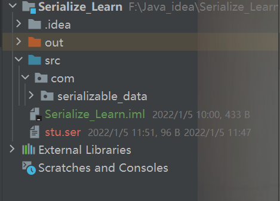

# Java 序列化（Serializable）

---

## 1  serialVersionUID

```java
serialVersionUID用作Serializable类中的版本控件。如果您没有显式声明serialVersionUID，JVM将根据您的Serializable类的各个方面自动为您执行此操作，如Java（TM）对象序列化规范中所述。 
```

serialVersionUID的作用

```
那么,生成SerialVersionUID对序列化有什么帮助呢?
SerialVersionUID又叫做'流标识符(Stream Unique Identifier)', 也就是类的版本定义.
即. JVM在反序列化时,会将'数据流'与'类'的SerialVersionUID比较是否相同. 
```

在开发中,序列化UID的生成有三种情况:

1. 不声明SerialVersionUID(编译器在编译的时候生成).

   有JVM生成默认的UID

2. 显式的声明SerialVersionUID(使用JDK工具生成).

3. 显式的声明固定值为'1L'的SerialVersionUID.  

   


### 1.2 .ser文件

#### 1.2.1 Java序列化步骤

```
1、序列化是干什么的？
       简单说就是为了保存在内存中的各种对象的状态，并且可以把保存的对象状态再读出来。虽然你可以用你自己的各种各样的方法来保存Object States，但是Java给你提供一种应该比你自己好的保存对象状态的机制,那就是序列化。
       
2、什么情况下需要序列化  
    a）当你想把的内存中的对象保存到一个文件中或者数据库中时候；
    b）当你想用套接字在网络上传送对象的时候；
    c）当你想通过RMI传输对象的时候；
   
3、相关注意事项
    a）当一个父类实现序列化，子类自动实现序列化，不需要显式实现Serializable接口；
    b）当一个对象的实例变量引用其他对象，序列化该对象时也把引用对象进行序列化；
    c）并非所有的对象都可以序列化，,至于为什么不可以，有很多原因了,比如：
        1.安全方面的原因，比如一个对象拥有private，public等field，对于一个要传输的对象，比如写到文件，或者进行rmi传输  等等，在序列化进行传输的过程中，这个对象的private等域是不受保护的。
       2. 资源分配方面的原因，比如socket，thread类，如果可以序列化，进行传输或者保存，也无法对他们进行重新的资源分  配，而且，也是没有必要这样实现。 
       
```

### 1.2.2 Java 实现序列化操作

```java
    // 实现序列化操作
    // 并且验证.ser文件
    public static void main(String[] args) {
        // 初始化类信息
        Student xiaoHong = new Student("小红", 12);
        // 类信息序列化,将已有的类信息序列化并且通过Java对象流存储信息
        try {
            FileOutputStream fs = new FileOutputStream("stu.ser");
            // stu.ser文件创建在src文件夹里
            ObjectOutputStream oos = new ObjectOutputStream(fs);
            oos.writeObject(xiaoHong);
        } catch (IOException e) {
            e.printStackTrace();
        }
        // 读取序列化文件里面的实例信息，并且在控制台输出
        try {
            FileInputStream fis = new FileInputStream("stu.ser");
            ObjectInputStream ois = new ObjectInputStream(fis);
            System.out.println(ois.readObject().toString());
        } catch (IOException | ClassNotFoundException e) {
            e.printStackTrace();
        }
    }
```


---

## 2 相同的serialVersionUID和不同的serialVersionUID2

### 2.1 java 显示的声明servialVersionUID

```java
// 显示声明serialVersionUID
private static final long serialVersionUID = 2L;
```

### 为什么声明固定值为'1L'的SerialVersionUID

> 建议, 没什么特殊要求的话,每次都显式声明固定值'1L'的SerialVersionUID  
> 上面有说到,每次在反序列化的时候,都会比较'数据流'和'类'的SerialVersionUID.
>   **如果相同**, 那么认为类没有改变,把'数据流'加载为'类'.
>   **如果不同**, 那么认为类发生了改变,JVM则会抛出异常(为了保证类的一致性).  
>
> ```java
>  com.serializable_data.Student; local class incompatible: stream classdesc serialVersionUID = -7825797140458810847, local class serialVersionUID = 2
> ```
>
> 





