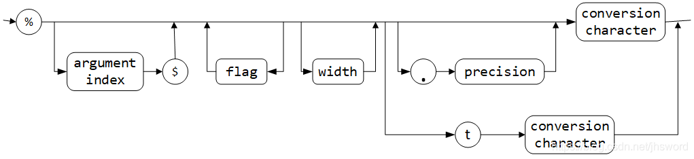
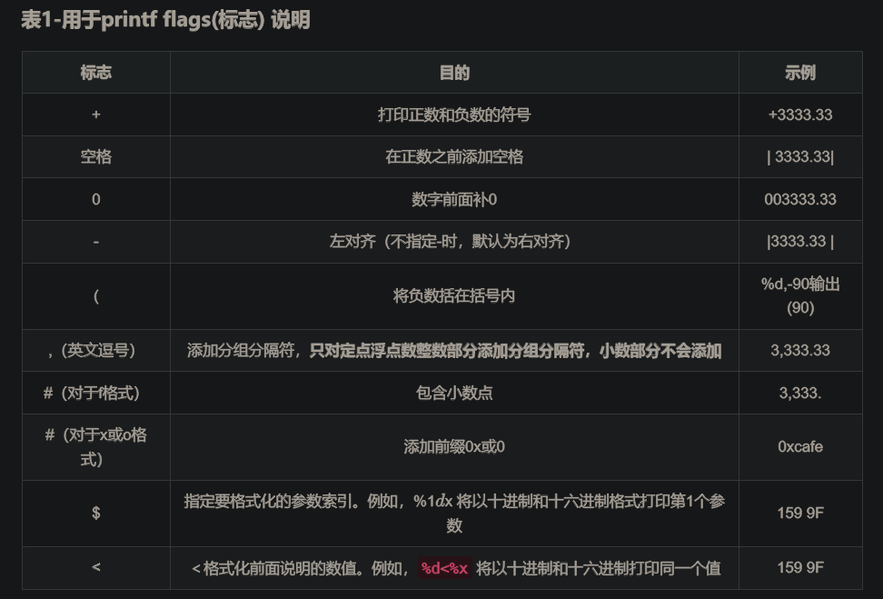
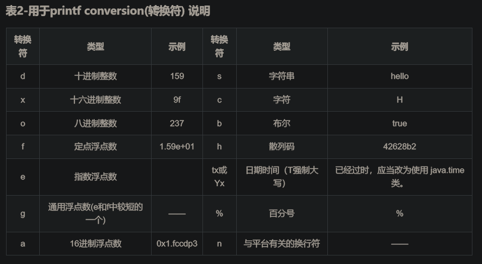

#### Java 格式化输出

---

## 1 输出方式

- System.out.println

  ​	内置输出格式，自由度较低，且自动换行

- System.out.print

  ​	内置输出格式，自由度较低，不自动换行

- System.out.printf

​			自定义输出格式，自由度较高，类似于C中的printf格式输出

## 2 格式化输出

**System.out.printf() 是 Java 5 开始引入的，用法类似 C语言的 printf() 函数， 但存在一定差异**

源代码->指定输出格式，可以多参数...arg

// 使用指定格式化字符串和参数将格式化字符写入到输出流

```java
	/**
     * A convenience method to write a formatted string to this output stream
     * using the specified format string and arguments.
     *
     * <p> An invocation of this method of the form <tt>out.printf(format,
     * args)</tt> behaves in exactly the same way as the invocation
     *
     * <pre>
     *     out.format(format, args) </pre>
     *
     * @param  format
     *         A format string as described in <a
     *         href="../util/Formatter.html#syntax">Format string syntax</a>
     *
     * @param  args
     *         Arguments referenced by the format specifiers in the format
     *         string.  If there are more arguments than format specifiers, the
     *         extra arguments are ignored.  The number of arguments is
     *         variable and may be zero.  The maximum number of arguments is
     *         limited by the maximum dimension of a Java array as defined by
     *         <cite>The Java&trade; Virtual Machine Specification</cite>.
     *         The behaviour on a
     *         <tt>null</tt> argument depends on the <a
     *         href="../util/Formatter.html#syntax">conversion</a>.
     *
     * @throws  java.util.IllegalFormatException
     *          If a format string contains an illegal syntax, a format
     *          specifier that is incompatible with the given arguments,
     *          insufficient arguments given the format string, or other
     *          illegal conditions.  For specification of all possible
     *          formatting errors, see the <a
     *          href="../util/Formatter.html#detail">Details</a> section of the
     *          formatter class specification.
     *
     * @throws  NullPointerException
     *          If the <tt>format</tt> is <tt>null</tt>
     *
     * @return  This output stream
     *
     * @since  1.5
     */
    public PrintStream printf(String format, Object ... args) {
        return format(format, args);
    }
```

// 基于本地化环境使用指定格式化字符串和参数将格式化字符写入到输出流

```java
/**
 * A convenience method to write a formatted string to this output stream
 * using the specified format string and arguments.
 *
 * <p> An invocation of this method of the form <tt>out.printf(l, format,
 * args)</tt> behaves in exactly the same way as the invocation
 *
 * <pre>
 *     out.format(l, format, args) </pre>
 *
 * @param  l
 *         The {@linkplain java.util.Locale locale} to apply during
 *         formatting.  If <tt>l</tt> is <tt>null</tt> then no localization
 *         is applied.
 *
 * @param  format
 *         A format string as described in <a
 *         href="../util/Formatter.html#syntax">Format string syntax</a>
 *
 * @param  args
 *         Arguments referenced by the format specifiers in the format
 *         string.  If there are more arguments than format specifiers, the
 *         extra arguments are ignored.  The number of arguments is
 *         variable and may be zero.  The maximum number of arguments is
 *         limited by the maximum dimension of a Java array as defined by
 *         <cite>The Java&trade; Virtual Machine Specification</cite>.
 *         The behaviour on a
 *         <tt>null</tt> argument depends on the <a
 *         href="../util/Formatter.html#syntax">conversion</a>.
 *
 * @throws  java.util.IllegalFormatException
 *          If a format string contains an illegal syntax, a format
 *          specifier that is incompatible with the given arguments,
 *          insufficient arguments given the format string, or other
 *          illegal conditions.  For specification of all possible
 *          formatting errors, see the <a
 *          href="../util/Formatter.html#detail">Details</a> section of the
 *          formatter class specification.
 *
 * @throws  NullPointerException
 *          If the <tt>format</tt> is <tt>null</tt>
 *
 * @return  This output stream
 *
 * @since  1.5
 */
public PrintStream printf(Locale l, String format, Object ... args) {
    return format(l, format, args);
}
```

### 2.1 参数说明

==format:==

format是以%开头的格式化字符串

```java
 %[argument_index$][flags][width][.precision]conversion
```



**argument index $**

```java
System.out.printf("%2$d %% %1$d = %3$d\n",6,15, 15 % 6);
// 第一个参数被第二个参数进行引用，第二个参数被第一个参数进行引用
```


flags转换符



conversion转换符号




format 源代码

```java
/**
     * Writes a formatted string to this output stream using the specified
     * format string and arguments.
     *
     * @param  l
     *         The {@linkplain java.util.Locale locale} to apply during
     *         formatting.  If <tt>l</tt> is <tt>null</tt> then no localization
     *         is applied.
     *
     * @param  format
     *         A format string as described in <a
     *         href="../util/Formatter.html#syntax">Format string syntax</a>
     *
     * @param  args
     *         Arguments referenced by the format specifiers in the format
     *         string.  If there are more arguments than format specifiers, the
     *         extra arguments are ignored.  The number of arguments is
     *         variable and may be zero.  The maximum number of arguments is
     *         limited by the maximum dimension of a Java array as defined by
     *         <cite>The Java&trade; Virtual Machine Specification</cite>.
     *         The behaviour on a
     *         <tt>null</tt> argument depends on the <a
     *         href="../util/Formatter.html#syntax">conversion</a>.
     *
     * @throws  java.util.IllegalFormatException
     *          If a format string contains an illegal syntax, a format
     *          specifier that is incompatible with the given arguments,
     *          insufficient arguments given the format string, or other
     *          illegal conditions.  For specification of all possible
     *          formatting errors, see the <a
     *          href="../util/Formatter.html#detail">Details</a> section of the
     *          formatter class specification.
     *
     * @throws  NullPointerException
     *          If the <tt>format</tt> is <tt>null</tt>
     *
     * @return  This output stream
     *
     * @since  1.5
     */
	arg参数个数依据Java虚拟机规范要求，如果locale为空方法则不使用本地环境将格式化字符串写入到此输出流
    public PrintStream format(Locale l, String format, Object ... args) {
        try {
            synchronized (this) {
                ensureOpen();
                if ((formatter == null)
                    || (formatter.locale() != l))
                    formatter = new Formatter(this, l);
                formatter.format(l, format, args);
            }
        } catch (InterruptedIOException x) {
            Thread.currentThread().interrupt();
        } catch (IOException x) {
            trouble = true;
        }
        return this;
    }
```


String.format

**API接口**

// 固定参数化字符串，不打印输出

```java
public static String format(String format, Object... args)
public static String format(Locale l, String format, Object... args)   
```

**日期和时间的参数化字符**

```
System.out.printf("%tc",new Date());
```


**arg**

args : 格式字符串中格式说明符引用的参数。如果参数多于格式说明符，则忽略额外参数。 参数的数量是可变的，可以为零。 参数的最大数量受The Java Virtual Machine Specification（java虚拟机规范）定义的Java数组的最大维数限制。 null参数上的行为取决于 conversion（转换符） 。

```java
System.out.printf("%1$s %2$tB %2$te, %2$tY","Due date:",new Date());
```


